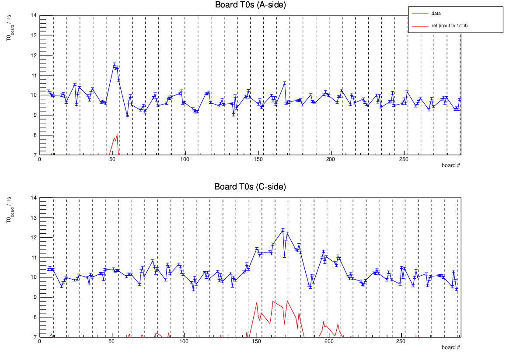

class: middle, center, title-slide
count: false

# TRT 'Manual' Data Calibration: Status

TRT days | 19/02/2020

  

Nathan Simpson 
[n.s@cern.ch](mailto:n.s@cern.ch)

---

class: middle

# What's new?

---

class: middle

# What's new? It works! (mostly)

---
class: middle

# Comparison: Old vs New

- Framework was validated against [this manual calibration](https://atlas-trt-web-dev.cern.ch/php/index.php?do=Pool.Calibration.define&Run=357713) for run 357713 data (`data18_13TeV`)
- Ran on a subset (~30%) of the data, cloned by rucio rule
- Same Athena release (21.0.66)
- Started with **different calibration constants**
  - The previous calibration used correct database constants for run 357713
  - These don't exist (at least where they were), so I used `dbconst.364485.txt`
  - Should still converge after 3 iterations

---
class: middle, center

# Residuals: Old

.center.width-50[]

---
class: middle, center

# Residuals: New

.center.width-50[]

---
class: middle, center

# Board $T_0$s: Old

.center.width-80[]

---
class: middle, center

# Board $T_0$s: New

.center.width-80[]
Started out with wrong calib. constants, but still looks very similar!

---

class: middle

# Timing
This took 56.5h to perform 3 iterations, including 'idle' time.
- 'Idle' == time jobs spend waiting to be assigned to a node
- Couldn't find this in Condor output metrics

The f/w as it stands is able to output job file size
- The bigger the RAW file, the more jobs are produced
- $Pr(waiting)$ increases...

As previously discussed, a way to reduce this idle time is to specify the HTCondor `JobFlavour` ahead of time. This study used a conservative 24h flavour, but this can definitely be changed since 1 iteration takes ~16h.

Will investigate!

---
class: middle

# Other additions to the manual f/w

The software now
- Can be run on both individual files and folders of multiple files
- Has tested, working instructions [on GitLab](https://gitlab.cern.ch/nsimpson/trtdatacalibration/tree/HTCondor)
- Is being documented more thoroughly at the level of the configuration file

An internal note is also in the works detailing the setup!

---

class: middle

# Small issues

Outstanding issues:
- Straw status plots are produced, but summary pdf is corrupted, unsure why
- Haven't tested with rel. 22
- Automated status emails no longer work, as the code was designed to parse log files from.
  - Will write a light python module to re-do this using Condor log files
- Unclear whether Tier-0 code will target HTCondor as the batch system?

---

class: middle

# Data/MC Interoperability

The software should run interchangeably on *data* or **MC**
  - Right now, we have three separate setups: *data* (manual), *data* (Tier-0), **MC**
  - Key idea: One piece of actual calibration code, multiple steering setups and/or job options for the three different use cases
  - How possible is this?
    - How do the Athena job options differ?

---
class: middle

# Data/MC Interoperability

Job options for **MC** are practically identical to the *RAW --> ntuple* step in *data* calibration.

But, the calibration steps in *data* differ:
  - Uses `TRTCalibrator` object, which seems to enable calibration for different sub-detector layers, and at different levels (straw, board, etc)
  - Not fully understood (at least for me)

Previous studies were performed that showed the **MC framework** runs on both *data* and **MC** ntuples with small differences in the residuals.

Possibly found steps to allow data calibration to run on RDO -- **see Eleni's talk for more info!**

---

class: middle

# Summary

- Manual calibration works
  - Small improvements to make to finish development & documentation
- Need status of Tier-0 code -- modify or leave?
- Data/MC frameworks can be harmonized, but not sure which setup is preferable

---

class: end-slide, center
count: false

The end :)
